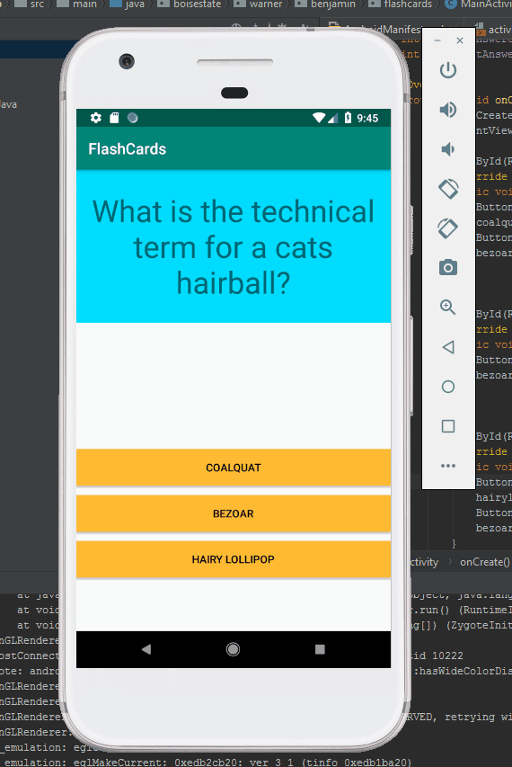
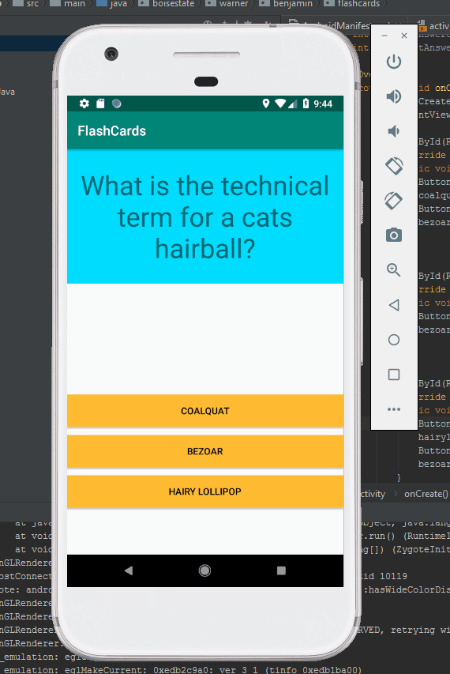

# FlashCards

## App Description

FlashCards is an app that allows a user to test there knowledge for 
a random assortment of facts.

### Incorrect Answer Selected

 

### Correct Answer Selected

 

### Required User Stories

- [x] 1. User sees a question in a text view object - What is the technical term for a cat's hairball?
- [x] 2. When user clicks on the screen the answer to the question is shown - Bezoar.

### Optional User Stories

- [ ] 1. Build in logic to toggle the flashcard between the question side and the answer side.
- [x] 2. Style the question and answer side of the card to better distinguish between the two sides.
- [ ] 3. Further customize and style the card.
- [x] 4. Add selectable multiple choice answers beneath the card (essentially disabled the required user story 2).
- [x] 5. Change the background color of the multiple choice answers when clicked to indicate whether the question was answered correctly.
- [ ] 6. Add a button that will toggle hiding and showing the answer choices.
