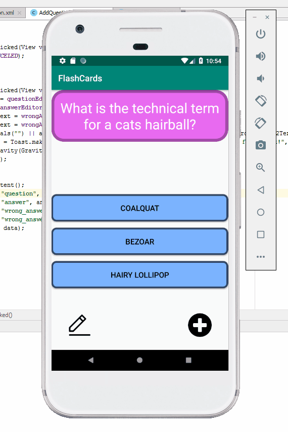

# FlashCards

## App Description

FlashCards is an app that allows a user to test their knowledge for 
a random assortment of facts.

## Lab 4

### App Description

Lab 4 further stylizes the app by adding animations when the user performs
any updates to the screen (going to a new question, adding/editing questions).

### App Usage

 

### Required User Stories

- [x] 1. User sees a transition animation when going from the main screen to the add card screen.
- [ ] 2. User sees a reveal animation when the flash card is tapped and the answer is shown (N/A because each question is multiple choice).
- [x] 3. User sees flashcards animating in / out when the 'next' and 'previous' button is tapped.

### Optional

- [ ] 1. Extra styling is added
- [ ] 1. User sees a countdown timer for each question
- [ ] 1. User sees a 'card flip' animation when the card is tapped
- [ ] 1. User sees a celebration animation with confetti when they answer a question correctly

### Unique User Stories

- [x] 1. User sees a color animation when a button is clicked (still a work in progress, but it's mostly there)

## Lab 3

### App Description

Lab 3 builds off of the functionality that a user can edit and add flash cards
inside the app. Instead of losing edited cards or even new cards upon app exit,
those changes are saved inside a database that the app accesses during runtime.

### App Usage

 

### Required User Stories

- [x] 1. Allow a user to create a card and still see their created card when the app is relaunched.
- [x] 2. User should be able to create multiple cards and browse through the deck (can go to next or previous).

### Optional User Stories

- [ ] 1. User should be able to delete a card and no longer see it in the deck
- [ ] 2. Randomize the order in which the cards are shown
- [x] 3. User should be able to edit a card and see the saved edit while browsing
- [x] 4. Multiple choice

### Unique User Stories

1. The correct answer button is randomly selected when the user browses through the deck

## Lab 2

### App Description

Lab 2 builds off of the initial application progress from lab 1 by allowing
a user to create their own question, on a by session basis (i.e, any new
questions added are unavailable the next time the app runs).

### App Usage

 

### Required User Stories

- [x] 1. User can click on a '+' button that takes the user to a new 'Add Card Screen'
- [x] 2. The 'Add Card Screen' has a cancel button to take the user back to the main screen
- [x] 3. User can enter and submit a question and answer through the 'Add Card Screen'
- [x] 4. User will see the card they just created on the main screen when they press the 'Save Button'
- [x] 5. Push your progress to GitHub!

### Optional User Stories

- [x] 1. User can edit a card
- [x] 1. An error message is shown if the user doesn't supply a question and answer
- [ ] 1. A notification is shown if the card was created successfully
- [x] 1. User can also enter multiple choice answers when creating a card
- [ ] 1. App is further styled and customized

### Unique User Stories

1. The correct answer button is randomly selected when the user adds/edits a question

## Lab 1

### App Usage

 

### Required User Stories

- [x] 1. User sees a question in a text view object - What is the technical term for a cat's hairball?
- [x] 2. When user clicks on the screen the answer to the question is shown - Bezoar.

### Optional User Stories

- [x] 1. Build in logic to toggle the flashcard between the question side and the answer side.
- [x] 2. Style the question and answer side of the card to better distinguish between the two sides.
- [x] 3. Further customize and style the card.
- [x] 4. Add selectable multiple choice answers beneath the card (essentially disabled the required user story 2).
- [x] 5. Change the background color of the multiple choice answers when clicked to indicate whether the question was answered correctly.
- [ ] 6. Add a button that will toggle hiding and showing the answer choices.
